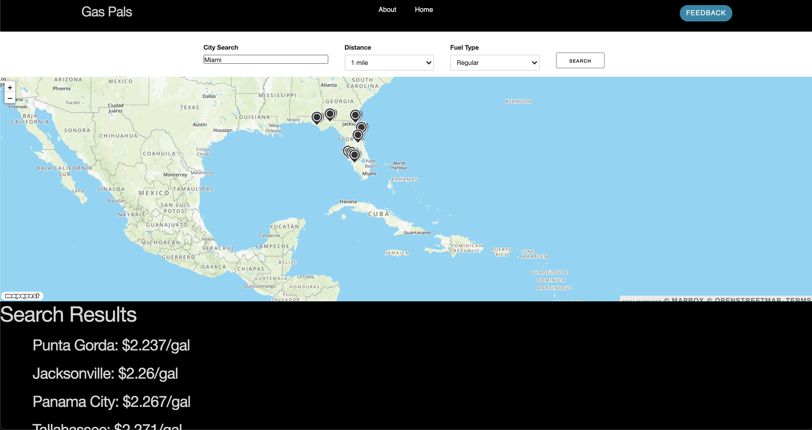

Gas Pals: Your Gas is on the Line 

This team effort came together following the financial burden that was 2020, leading this group to establish an application to seek out the cheapest gas near an individual based on search parameters. However, as this knowledge is not as readily available without user intervention, the app in its current form, instead directs the user to the cheapest cities in a state, with an interactive map, dropped pins, and a collection of data based on the search. 

Issues include: 
API data structure not existing
CORS issues across other APIS

These issues are part of a continued effort towards resolution, to make this application what it was desired to be. 

Screenshot 

Collaborators:
-Jonathan Smith
-Curt Spiegelhalter
-Remmington Pascone
-Mir Hasan

Link Url: 
https://jpls218.github.io/Your_Gas_Is_On_The_Line/